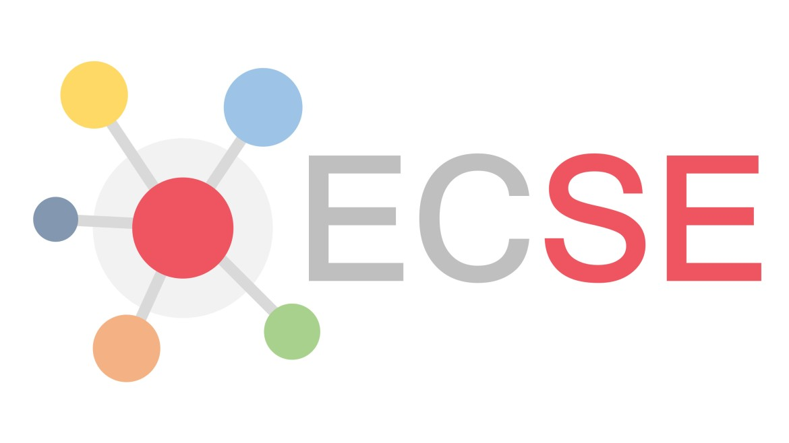

  <h2 style="color: #60a5fa; margin-bottom: 2rem;">Verifizierung erforderlich</h2>
  
Bestätigen Sie, dass Sie ein Mensch sind, um auf die AI4MBSE-Dokumentation zuzugreifen.

  

  

<main role="main" id="ai4mbse-content" style="display: none;">
  <article class="plugin-documentation">
    <!-- Hero Section -->
    <header class="hero glass-morphism ai4mbse-banner-hero" role="banner">
      

        <h1 class="ai4mbse-banner-title">AI4MBSE Plugin</h1>
        

          KI-Integration für Magic Systems of Systems Architect 
          Automatisierung. Intelligenz. Effizienz.
        

        <!-- Navigation Menu -->
        <nav class="hero-navigation" style="margin-top: 2rem;">
          

            <a href="#project-title" class="nav-link">Projekt</a>
            <a href="#features-title" class="nav-link">Funktionen</a>
            <a href="#requirements-title" class="nav-link">Systemanforderungen</a>
            <a href="#download-title" class="nav-link">Download</a>
            <a href="#install-title" class="nav-link">Installation</a>
            <a href="#quickstart-title" class="nav-link">Quick Start</a>
            <a href="#troubleshooting-title" class="nav-link">FAQ</a>
            <a href="#demo-title" class="nav-link">Demo</a>
          

        </nav>
      

    </header>

    <section class="section project-section glass-morphism" aria-labelledby="project-title">
    

        <h2 id="project-title" class="section-title">
        <ai4mbse-icon name="project"></ai4mbse-icon> Projekt
        </h2>
        

        <!-- Äußere Flexbox: ganz links die Logos, rechts davon der Text -->
        

            <!-- Kleiner Untercontainer nur für die beiden Logos -->
            

            
            
            
            

            

                Logos der Hochschule München und des Experience Centers Systems Engineering verwendet mit freundlicher Genehmigung
            

            <!-- Text bleibt als zweites Flex-Kind -->
            

            Das Plugin AI4MBSE wurde im Rahmen des Kurses Systems Engineering Projekt 
            im Masterstudiengang Systems Engineering der Fakultät 4 an der Hochschule München 
            entwickelt. Die Idee und Aufgabenstellung stammt von Prof. Dr. Claudio Zuccaro 
            und verfolgt das Ziel, die automatische Erstellung von Verknüpfungen in einem 
            SysML-Systemmodell durch den Einsatz künstlicher Intelligenz zu unterstützen. 
            Realisiert wurde das Projekt mit freundlicher Unterstützung des Experience Centers 
            Systems Engineering.
            

        

        

    

    </section>

    <!-- Features Section -->
    <section class="section features-section glass-morphism" aria-labelledby="features-title">
    

        <h2 id="features-title" class="section-title">
        <ai4mbse-icon name="features"></ai4mbse-icon> Funktionen
        </h2>
        

        

            

                <h3 class="feature-title">🤖 KI-gestützte Anforderungsallokation</h3>
                

                    Automatische Zuordnung von Systemanforderungen zu passenden Subsystemen 
                    durch Google Gemini AI mit Konfidenzwerten und Begründungen.
                

            

            
            

                <h3 class="feature-title">⚡ Asynchrone Verarbeitung</h3>
                

                    Keine UI-Blockierung während der AI-Analyse. Echtzeitfortschritt 
                    und Abbruchmöglichkeit für große Projektdaten.
                

            

            
            

                <h3 class="feature-title">🔄 Automatische Modellintegration</h3>
                

                    Erstellt automatisch SysML Satisfy-Abhängigkeiten zwischen 
                    Anforderungen und Subsystemen nach Bestätigung.
                

            

            
            

                <h3 class="feature-title">📁 Interaktive Ordnerauswahl</h3>
                

                    Dynamische Navigation durch Projektstrukturen. Unterstützung 
                    für große Projekte mit 1000+ Anforderungen.
                

            

            
            

                <h3 class="feature-title">🔑 Einfache API-Verwaltung</h3>
                

                    Direkte Eingabe des Google Gemini API-Schlüssels im Plugin. 
                    Keine komplizierte Umgebungsvariablen-Konfiguration.
                

            

            
            

                <h3 class="feature-title">📊 Intelligente Bewertung</h3>
                

                    AI liefert Konfidenzwerte und detaillierte Begründungen 
                    für jede Allokationsempfehlung.
                

            

        

        

    

    </section>

    <!-- System Requirements Section -->
    <section class="section requirements-section glass-morphism" aria-labelledby="requirements-title">
    

        <h2 id="requirements-title" class="section-title">
        <ai4mbse-icon name="system"></ai4mbse-icon> Systemanforderungen
        </h2>
        

        

            

                <h3 class="category-title">Software</h3>
                <ul class="requirement-list">
                    <li><strong>Magic Systems of Systems Architect:</strong> 2024x oder neuer</li>
                    <li><strong>Cameo Systems Modeler:</strong> 2024x oder neuer</li>
                    <li><strong>Java:</strong> Version 17 oder höher</li>
                    <li><strong>Google Gemini API:</strong> Aktiver API-Schlüssel erforderlich</li>
                </ul>
            

            
            

                <h3 class="category-title">Betriebssystem</h3>
                <ul class="requirement-list">
                    <li><strong>Windows:</strong> 10 oder 11 (getestet)</li>
                    <li><strong>macOS:</strong> 10.15+ (theoretisch unterstützt)</li>
                    <li><strong>Linux:</strong> Ubuntu 20.04+ (theoretisch unterstützt)</li>
                </ul>
            

            
            

                <h3 class="category-title">Hardware</h3>
                <ul class="requirement-list">
                    <li><strong>RAM:</strong> Mindestens 4 GB, 8 GB empfohlen</li>
                    <li><strong>Speicher:</strong> 50 MB für Plugin-Installation</li>
                    <li><strong>Internetverbindung:</strong> Für Google Gemini API erforderlich</li>
                </ul>
            

        

        

    

    </section>

    <section class="section download-section glass-morphism ai4mbse-download" aria-labelledby="download-title">
    

        <h2 id="download-title" class="section-title">
        <ai4mbse-icon name="download"></ai4mbse-icon> Download
        </h2>
        

            

                

                    

                        <h3>AI4MBSE Plugin v1.7</h3>
                        ~2.5 MB
                    

                    
                    

                        <a href="AI4MBSE_Plugin.zip" class="cta-button enhanced-download">
                            ⬇️
                            Plugin herunterladen
                        </a>
                    

                    
                    

                        <small>💡 Vollständiges ZIP-Paket mit allen Installationsdateien</small>
                    

                

            

        

    

    </section>
   

    <!-- Installation Section -->
    <section class="section installation-section glass-morphism" aria-labelledby="install-title">
    

        <h2 id="install-title" class="section-title">
        <ai4mbse-icon name="install"></ai4mbse-icon> Installation
        </h2>
        
        

        

            

                <strong>Hinweis:</strong> Das Plugin wurde ausschließlich unter <b>Windows</b> getestet. Die Anleitung und Installationsschritte beziehen sich nur auf Windows-Systeme.
            

            
            

                <strong>API-Schlüssel erforderlich:</strong> Das Plugin benötigt einen kostenlosen Google Gemini API-Schlüssel. 
                <a href="https://ai.google.dev/gemini-api/docs/api-key?hl=de" target="_blank" rel="noopener" class="link-primary">Hier können Sie einen API-Schlüssel erstellen</a>.
                Das Plugin fragt beim ersten Start nach dem Schlüssel.
            

            
            

            <h3 class="step-title">1. ZIP-Paket herunterladen</h3>
            

                Klicken Sie auf den Download-Button und speichern Sie die AI4MBSE_Plugin.zip-Datei lokal auf Ihrem Computer.
            

            

            
            

            <h3 class="step-title">2. ZIP-Paket entpacken</h3>
            
Entpacken Sie das ZIP-Paket direkt in das folgende Verzeichnis:

            <pre class="code-block">
    <code>
    C:\Users\YOUR_USERNAME\AppData\Local\.magic.systems.of.systems.architect\2024x\plugins
    </code>
            </pre>
            

                Im Plugins-Ordner sollte anschließend ein AI4MBSE-Ordner mit allen relevanten Dateien enthalten sein.
            

            

        

        

    

    </section>

    <!-- GitHub Repository Section -->
    <section class="section github-section glass-morphism" aria-labelledby="github-title">
    

        <h2 id="github-title" class="section-title">
        <ai4mbse-icon name="github"></ai4mbse-icon> GitHub Repository
        </h2>
        

        

            

                

                    
📂

                    

                        <h3>kingsepp/AI4MBSE</h3>
                        
KI-gestütztes Plugin für Magic Systems of Systems Architect

                    

                    
MIT

                

                
                

                    

                        ⭐
                        Open Source
                    

                    

                        📄
                        MIT Lizenz
                    

                    

                        🔧
                        Java Plugin
                    

                

                
                

                    <a href="https://github.com/kingsepp/AI4MBSE" target="_blank" rel="noopener" class="cta-button github-link">
                        🔗
                        Repository ansehen
                    </a>
                    

                        <small>Vollständiger Quellcode, Dokumentation und Entwicklungshistorie</small>
                    

                

            

        

        

    

    </section>

    <!-- Quick Start Section -->
    <section class="section quickstart-section glass-morphism" aria-labelledby="quickstart-title">
    

        <h2 id="quickstart-title" class="section-title">
        <ai4mbse-icon name="quickstart"></ai4mbse-icon> Quick Start
        </h2>
        

        

            

                Nach der Installation können Sie sofort mit der KI-gestützten Anforderungsallokation beginnen:
            

            
            

                

                    
1

                    

                        <h4 class="step-title">Plugin starten</h4>
                        

                            Öffnen Sie Magic Draw/Cameo und navigieren Sie zu <strong>Tools → Find Subsystem for Requirement (AI4MBSE)</strong>
                        

                    

                

                
                

                    
2

                    

                        <h4 class="step-title">API-Schlüssel eingeben</h4>
                        

                            Beim ersten Start werden Sie nach Ihrem Google Gemini API-Schlüssel gefragt. 
                            <a href="https://ai.google.dev/gemini-api/docs/api-key?hl=de" target="_blank" rel="noopener">Hier erstellen</a>
                        

                    

                

                
                

                    
3

                    

                        <h4 class="step-title">Anforderungsordner auswählen</h4>
                        

                            Wählen Sie das Package mit Ihren Systemanforderungen aus der Projektstruktur
                        

                    

                

                
                

                    
4

                    

                        <h4 class="step-title">Spezifische Anforderung wählen</h4>
                        

                            Selektieren Sie die konkrete Anforderung, die Sie einem Subsystem zuordnen möchten
                        

                    

                

                
                

                    
5

                    

                        <h4 class="step-title">Subsystem-Ordner auswählen</h4>
                        

                            Wählen Sie das Package mit Ihren verfügbaren Subsystemen
                        

                    

                

                
                

                    
6

                    

                        <h4 class="step-title">KI-Empfehlungen prüfen</h4>
                        

                            Überprüfen Sie die AI-Vorschläge mit Konfidenzwerten und Begründungen, dann bestätigen Sie die gewünschten Allokationen
                        

                    

                

            

            
            

                <strong>💡 Tipp:</strong> Das Plugin funktioniert am besten mit gut strukturierten SysML-Modellen und klaren Anforderungsbeschreibungen.
            

        

        

    

    </section>

    <!-- Troubleshooting Section -->
    <section class="section troubleshooting-section glass-morphism" aria-labelledby="troubleshooting-title">
    

        <h2 id="troubleshooting-title" class="section-title">
        <ai4mbse-icon name="help"></ai4mbse-icon> Häufige Probleme & Lösungen
        </h2>
        

        

            

                <h3 class="faq-question">Plugin erscheint nicht im Tools-Menü</h3>
                

                    
<strong>Lösung:</strong>

                    <ul>
                        <li>Überprüfen Sie, ob das Plugin korrekt im Plugins-Ordner entpackt wurde</li>
                        <li>Starten Sie Magic Draw/Cameo neu</li>
                        <li>Prüfen Sie die Konsole auf Fehlermeldungen: <em>Help → System Info → Log</em></li>
                    </ul>
                

            

            
            

                <h3 class="faq-question">API-Authentifizierungsfehler</h3>
                

                    
<strong>Lösung:</strong>

                    <ul>
                        <li>Überprüfen Sie Ihren Google Gemini API-Schlüssel</li>
                        <li>Stellen Sie sicher, dass der API-Schlüssel aktiv und nicht abgelaufen ist</li>
                        <li>Prüfen Sie Ihre Internetverbindung</li>
                        <li>Geben Sie den API-Schlüssel erneut im Plugin-Dialog ein</li>
                    </ul>
                

            

            
            

                <h3 class="faq-question">Plugin reagiert nicht/hängt</h3>
                

                    
<strong>Lösung:</strong>

                    <ul>
                        <li>Nutzen Sie die Abbruch-Funktion im Plugin-Dialog</li>
                        <li>Bei sehr großen Modellen: Verarbeiten Sie kleinere Anforderungsgruppen</li>
                        <li>Überprüfen Sie die verfügbare RAM (mindestens 4 GB empfohlen)</li>
                    </ul>
                

            

            
            

                <h3 class="faq-question">Keine Subsysteme gefunden</h3>
                

                    
<strong>Lösung:</strong>

                    <ul>
                        <li>Stellen Sie sicher, dass Ihr Subsystem-Package korrekte SysML-Blöcke enthält</li>
                        <li>Überprüfen Sie die Package-Struktur in Ihrem Modell</li>
                        <li>Verwenden Sie die interaktive Ordnerauswahl zur Navigation</li>
                    </ul>
                

            

            
            

                <h3 class="faq-question">KI-Vorschläge sind ungenau</h3>
                

                    
<strong>Lösung:</strong>

                    <ul>
                        <li>Verbessern Sie die Beschreibungen Ihrer Anforderungen</li>
                        <li>Verwenden Sie präzise, technische Sprache</li>
                        <li>Achten Sie auf die Konfidenzwerte der KI-Empfehlungen</li>
                        <li>Nutzen Sie die Begründungen der KI zur Nachvollziehbarkeit</li>
                    </ul>
                

            

        

        
        

    

    </section>

    <!-- Demo Section -->
    <section class="section demo-section glass-morphism" aria-labelledby="demo-title">
      

        <h2 id="demo-title" class="section-title">
          <ai4mbse-icon name="video"></ai4mbse-icon> Live Demo
        </h2>
        
        

          

            
Schauen Sie sich die folgende Demo an, um zu sehen, wie das AI4MBSE-Plugin funktioniert:

            
            

            <video width="640" height="360" controls>
                <source src="demo.mp4" type="video/mp4">
                Ihr Browser unterstützt das Video-Tag nicht.
            </video>
            

          

        

      

    </section>
  </article>
</main>

<!-- Back to Top Button -->
<button id="backToTop" class="back-to-top" onclick="scrollToTop()" style="display: none;">
  ↑ Nach oben
</button>

<!-- Scripts for fancy hero animation -->

<!-- Back to Top Functionality -->

