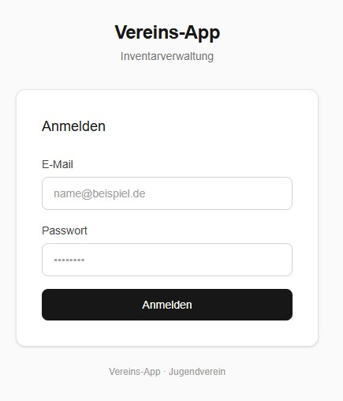
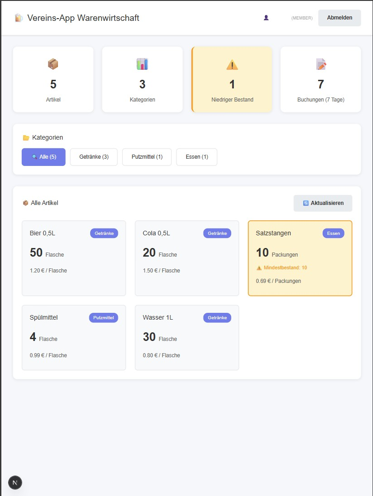

<main role="main" id="vereins-app-content">
  <article class="project-documentation">
    <!-- Hero Section -->
    <header class="hero glass-morphism" role="banner">
      

        <h1>Vereins-App</h1>
        

          Full-Stack-Webanwendung zur digitalen Warenwirtschaft und Benutzerverwaltung 
          Modern. Rollenbasiert. Transaktionssicher.
        

        <!-- Navigation Menu -->
        <nav class="hero-navigation" style="margin-top: 2rem;">
          

            <a href="#overview-title" class="nav-link">Überblick</a>
            <a href="#screenshots-title" class="nav-link">Screenshots</a>
            <a href="#features-title" class="nav-link">Funktionen</a>
            <a href="#tech-stack-title" class="nav-link">Technologie-Stack</a>
            <a href="#architecture-title" class="nav-link">Architektur</a>
          

        </nav>
      

    </header>

    <!-- Overview Section -->
    <section class="section glass-morphism" aria-labelledby="overview-title">
      

        <h2 id="overview-title" class="section-title">📦 Projekt-Überblick</h2>
        

          

            Die Vereins-App ist eine Full-Stack-Webanwendung zur digitalen Verwaltung von Lagerbeständen,
            Buchungen und Benutzern für einen Verein. Die App ersetzt manuelle Bestandslisten durch
            ein rollenbasiertes System mit Echtzeit-Bestandsübersicht, Ein-/Ausbuchungen und Admin-Funktionen.
          

          

            Entwickelt mit modernsten Technologien wie <strong>Next.js 16</strong>, <strong>React 19</strong>
            und <strong>PostgreSQL</strong>, bietet die Anwendung eine skalierbare und wartbare Lösung für
            digitales Bestandsmanagement.
          

        

      

    </section>

    <!-- Screenshots Section -->
    <section class="section glass-morphism" aria-labelledby="screenshots-title">
      

        <h2 id="screenshots-title" class="section-title">🖼️ Screenshots</h2>
        

          

            

              
Login-Bereich

              
              

                Sicherer Login mit JWT-Authentifizierung und bcrypt-Passwort-Hashing
              

            

            
            

              
Dashboard-Übersicht

              
              

                Zentrale Übersicht mit Echtzeit-Statistiken und Schnellzugriff auf alle Module
              

            

          

        

      

    </section>

    <!-- Features Section -->
    <section class="section glass-morphism" aria-labelledby="features-title">
      

        <h2 id="features-title" class="section-title">✨ Funktionsumfang</h2>
        

          

            

              <h3>📊 Warenwirtschaft</h3>
              

                Artikel und Kategorien anlegen, bearbeiten und löschen. Lagerbestände mit Ein- und
                Ausbuchungen verwalten inkl. automatischer Bestandsberechnung.
              

            

            

              <h3>⚠️ Bestandswarnungen</h3>
              

                Automatische Low-Stock-Erkennung wenn Artikel unter den definierten Mindestbestand fallen.
              

            

            

              <h3>👥 Benutzerverwaltung</h3>
              

                Admins können Benutzer anlegen und löschen. Drei Rollen (Admin, Vorstand, Mitglied)
                mit abgestuften Berechtigungen.
              

            

            

              <h3>🔐 Rollenbasiertes System</h3>
              

                Mitglieder sehen Bestände, Vorstand kann zusätzlich buchen, Admins haben Vollzugriff
                inkl. Stammdaten und Benutzerverwaltung.
              

            

            

              <h3>📈 Dashboard</h3>
              

                Zentrale Übersicht mit Statistiken (Artikelanzahl, Kategorien, niedrige Bestände,
                aktuelle Buchungen) und Schnellzugriff auf alle Module.
              

            

            

              <h3>🔒 Sicherheit</h3>
              

                JWT-Authentifizierung mit HttpOnly Cookies, bcrypt-Passwort-Hashing und
                Edge-Middleware für performante Verifizierung.
              

            

          

        

      

    </section>

    <!-- Technology Stack Section -->
    <section class="section glass-morphism" aria-labelledby="tech-stack-title">
      

        <h2 id="tech-stack-title" class="section-title">🛠️ Technologie-Stack</h2>
        

          <table class="tech-table">
            <thead>
              <tr>
                <th>Bereich</th>
                <th>Technologie</th>
              </tr>
            </thead>
            <tbody>
              <tr>
                <td><strong>Framework</strong></td>
                <td>Next.js 16 (App Router, Turbopack)</td>
              </tr>
              <tr>
                <td><strong>Frontend</strong></td>
                <td>React 19, TypeScript 5</td>
              </tr>
              <tr>
                <td><strong>Styling</strong></td>
                <td>Tailwind CSS v4 (CSS-first)</td>
              </tr>
              <tr>
                <td><strong>Backend/API</strong></td>
                <td>Next.js Route Handlers (REST)</td>
              </tr>
              <tr>
                <td><strong>Datenbank</strong></td>
                <td>PostgreSQL</td>
              </tr>
              <tr>
                <td><strong>ORM</strong></td>
                <td>Prisma 7</td>
              </tr>
              <tr>
                <td><strong>Authentifizierung</strong></td>
                <td>JWT (HttpOnly Cookies), bcrypt, Edge-Middleware</td>
              </tr>
              <tr>
                <td><strong>Testing</strong></td>
                <td>Vitest 4, Unit Tests mit Mocking</td>
              </tr>
              <tr>
                <td><strong>Monorepo</strong></td>
                <td>pnpm Workspaces</td>
              </tr>
              <tr>
                <td><strong>Code-Qualität</strong></td>
                <td>ESLint, Prettier, Husky (pre-commit & pre-push Hooks)</td>
              </tr>
              <tr>
                <td><strong>Hosting-ready</strong></td>
                <td>Node.js Runtime, Docker-kompatibel</td>
              </tr>
            </tbody>
          </table>
        

      

    </section>

    <!-- Architecture Section -->
    <section class="section glass-morphism" aria-labelledby="architecture-title">
      

        <h2 id="architecture-title" class="section-title">🏗️ Architektur-Highlights</h2>
        

          

            <h3>🔹 Monorepo-Struktur</h3>
            

              Saubere Paket-Trennung mit pnpm Workspaces für optimale Modularität und Wartbarkeit.
            

          

          

            <h3>🔹 Edge Middleware</h3>
            

              Performante JWT-Verifizierung ohne DB-Roundtrip bei jedem Request für maximale Performance.
            

          

          

            <h3>🔹 Server-seitige Rollenprüfung</h3>
            

              Bei jeder API-Anfrage direkt gegen die Datenbank — JWT wird nur für Authentifizierung,
              nie für Autorisierung vertraut. Zero-Trust-Prinzip für maximale Sicherheit.
            

          

          

            <h3>🔹 Transaktionssichere Buchungen</h3>
            

              Prisma-Transaktionen mit serverseitiger Validierung — kein negativer Bestand möglich.
              Cascade-Deletes innerhalb von DB-Transaktionen für referentielle Integrität.
            

          

          

            <h3>🔹 Umfangreiche Test-Abdeckung</h3>
            

              Vollständige Backend-Logik mit isolierten Unit Tests für hohe Code-Qualität und
              Wartbarkeit.
            

          

        

      

    </section>

  </article>
</main>

<!-- Back to Top Button -->
<button id="backToTop" class="back-to-top" onclick="scrollToTop()" style="display: none;">
  ↑ Nach oben
</button>

